# Modelo relacional da base corporativa

Data da analise: 2026-06-28

## Objetivo

Documentar o modelo relacional restaurado da base corporativa, explicando como os schemas `geral` e `vendas` se relacionam entre si e como alimentam as camadas `stage` e `data_warehouse`.

Esta etapa e exclusivamente documental. Nenhuma estrutura do banco foi alterada.

## Visao geral do modelo

A base restaurada possui quatro camadas logicas principais:

| Camada | Schemas | Papel |
| --- | --- | --- |
| Cadastro corporativo | `geral` | Entidades mestres de pessoa, contato e localizacao |
| Transacional | `vendas` | Processo de venda, nota fiscal, item, produto e forma de pagamento |
| Intermediaria | `stage` | Recortes de apoio/carga para transformacao |
| Analitica | `data_warehouse` e `public` | Modelo dimensional e view de consumo |

O fluxo conceitual e:

```text
geral + vendas
      |
      v
    stage
      |
      v
data_warehouse
      |
      v
public.view_dt_mart_vendas
```

## Modelo por schema

### Schema `geral`

O schema `geral` concentra entidades de cadastro. Ele nao representa diretamente a venda, mas fornece os sujeitos e atributos usados no processo transacional:

- clientes;
- vendedores;
- fornecedores;
- pessoas fisicas;
- pessoas juridicas;
- enderecos;
- contatos;
- hierarquia geografica.

Principais entidades:

| Tabela | Tipo | Papel |
| --- | --- | --- |
| `pessoa` | Entidade mestre | Entidade base para qualquer pessoa do sistema |
| `pessoa_fisica` | Entidade de especializacao | Dados de individuo, vinculados a `pessoa` |
| `pessoa_juridica` | Entidade de especializacao | Dados de empresa, vinculados a `pessoa` |
| `responsavel_juridico` | Entidade associativa | Relaciona pessoa fisica responsavel a pessoa juridica |
| `estado` | Dominio/localizacao | Estados |
| `cidade` | Dominio/localizacao | Cidades, dependentes de estado |
| `bairro` | Dominio/localizacao | Bairros, dependentes de cidade |
| `endereco` | Entidade dependente | Endereco de uma pessoa |
| `tipo_contato` | Dominio | Tipos de contato |
| `contato` | Entidade dependente | Contatos vinculados a pessoa |

Relacionamentos principais:

- `estado` 1:N `cidade`
- `cidade` 1:N `bairro`
- `bairro` 1:N `endereco`
- `pessoa` 1:N `endereco`
- `pessoa` 1:N `contato`
- `tipo_contato` 1:N `contato`
- `pessoa` 1:1 `pessoa_fisica`
- `pessoa` 1:1 `pessoa_juridica`
- `pessoa` N:N `pessoa`, por meio de `responsavel_juridico`

Observacao: a FK `geral.endereco.id_pessoa -> geral.pessoa.id` foi restaurada como `NOT VALID`, preservando o estado original do dump.

### Schema `vendas`

O schema `vendas` representa o processo transacional de venda. Ele usa entidades de `geral` para identificar clientes, vendedores e fornecedores.

Principais entidades/transacoes:

| Tabela | Tipo | Papel |
| --- | --- | --- |
| `categoria` | Dominio | Classificacao dos produtos |
| `forma_pagamento` | Dominio | Formas de pagamento |
| `produto` | Entidade de negocio | Produto comercializado, vinculado a categoria e fornecedor |
| `nota_fiscal` | Transacao de cabecalho | Venda/nota fiscal, vinculada a cliente, vendedor e forma de pagamento |
| `item_nota_fiscal` | Transacao de detalhe | Itens/produtos vendidos dentro da nota |

Relacionamentos principais:

- `categoria` 1:N `produto`
- `geral.pessoa` 1:N `produto`, no papel de fornecedor
- `geral.pessoa` 1:N `nota_fiscal`, no papel de cliente
- `geral.pessoa` 1:N `nota_fiscal`, no papel de vendedor
- `forma_pagamento` 1:N `nota_fiscal`
- `nota_fiscal` 1:N `item_nota_fiscal`
- `produto` 1:N `item_nota_fiscal`

Observacao: as FKs do schema `vendas` foram restauradas como `NOT VALID`. Elas existem no banco, mas ainda nao foram validadas retrospectivamente pelo PostgreSQL.

### Schema `stage`

O schema `stage` funciona como camada intermediaria. Ele contem subconjuntos de dados que parecem apoiar o processo de carga/transformacao para a camada dimensional.

Tabelas:

| Tabela | Origem conceitual | Papel |
| --- | --- | --- |
| `stage.forma_pagamento` | `vendas.forma_pagamento` | Apoio para dimensao/forma de pagamento |
| `stage.nota_fiscal` | `vendas.nota_fiscal` | Recorte de cabecalho de venda |
| `stage.pessoa_fisica` | `geral.pessoa_fisica` | Apoio para nomes de clientes/vendedores |
| `stage.pessoa_juridica` | `geral.pessoa_juridica` | Apoio para razoes sociais de clientes/fornecedores |

O schema `stage` nao possui foreign keys para `geral` ou `vendas`. Isso sugere que ele foi usado como area de preparacao: recebe dados ja extraidos e simplificados, antes da montagem final das dimensoes e fatos.

### Schema `data_warehouse`

O schema `data_warehouse` e a camada dimensional derivada do modelo relacional/transacional.

Tabelas:

| Tabela | Tipo dimensional | Origem conceitual |
| --- | --- | --- |
| `dim_cliente` | Dimensao | `geral.pessoa`, `pessoa_fisica`, `pessoa_juridica`, `endereco`, `bairro`, `cidade`, `estado` |
| `dim_produto` | Dimensao | `vendas.produto`, `vendas.categoria` |
| `dim_vendedor` | Dimensao | `geral.pessoa_fisica` / pessoas usadas como vendedor |
| `dim_forma_pagamento` | Dimensao | `vendas.forma_pagamento` / `stage.forma_pagamento` |
| `dim_tempo` | Dimensao calendario | Datas de venda expandidas em atributos calendario |
| `fato_vendas` | Fato de cabecalho | `vendas.nota_fiscal` |
| `fato_vendas_detalhes` | Fato de item | `vendas.item_nota_fiscal` + `vendas.nota_fiscal` + dimensoes |

O `data_warehouse` possui FKs validadas entre fatos e dimensoes, formando um desenho dimensional consistente para analise.

## Diagrama ER

O diagrama abaixo mostra as entidades mais importantes e os relacionamentos restaurados. As tabelas de `stage` aparecem como camada intermediaria sem FKs formais.

Arquivos externos do diagrama:

- [03A_diagrama_erd.mmd](03A_diagrama_erd.mmd)
- [03A_diagrama_erd.png](03A_diagrama_erd.png)

```mermaid
erDiagram
    GERAL_ESTADO ||--o{ GERAL_CIDADE : possui
    GERAL_CIDADE ||--o{ GERAL_BAIRRO : possui
    GERAL_BAIRRO ||--o{ GERAL_ENDERECO : localiza
    GERAL_PESSOA ||--o{ GERAL_ENDERECO : possui
    GERAL_PESSOA ||--o{ GERAL_CONTATO : possui
    GERAL_TIPO_CONTATO ||--o{ GERAL_CONTATO : classifica
    GERAL_PESSOA ||--o| GERAL_PESSOA_FISICA : especializa
    GERAL_PESSOA ||--o| GERAL_PESSOA_JURIDICA : especializa
    GERAL_PESSOA ||--o{ GERAL_RESPONSAVEL_JURIDICO : responsavel_pf
    GERAL_PESSOA ||--o{ GERAL_RESPONSAVEL_JURIDICO : empresa_pj

    GERAL_PESSOA ||--o{ VENDAS_NOTA_FISCAL : cliente
    GERAL_PESSOA ||--o{ VENDAS_NOTA_FISCAL : vendedor
    GERAL_PESSOA ||--o{ VENDAS_PRODUTO : fornecedor
    VENDAS_CATEGORIA ||--o{ VENDAS_PRODUTO : classifica
    VENDAS_FORMA_PAGAMENTO ||--o{ VENDAS_NOTA_FISCAL : paga
    VENDAS_NOTA_FISCAL ||--o{ VENDAS_ITEM_NOTA_FISCAL : contem
    VENDAS_PRODUTO ||--o{ VENDAS_ITEM_NOTA_FISCAL : vendido_em

    VENDAS_FORMA_PAGAMENTO ||..o{ STAGE_FORMA_PAGAMENTO : alimenta
    VENDAS_NOTA_FISCAL ||..o{ STAGE_NOTA_FISCAL : alimenta
    GERAL_PESSOA_FISICA ||..o{ STAGE_PESSOA_FISICA : alimenta
    GERAL_PESSOA_JURIDICA ||..o{ STAGE_PESSOA_JURIDICA : alimenta

    GERAL_PESSOA ||..o{ DW_DIM_CLIENTE : transforma
    VENDAS_PRODUTO ||..o{ DW_DIM_PRODUTO : transforma
    GERAL_PESSOA ||..o{ DW_DIM_VENDEDOR : transforma
    VENDAS_FORMA_PAGAMENTO ||..o{ DW_DIM_FORMA_PAGAMENTO : transforma
    VENDAS_NOTA_FISCAL ||..o{ DW_FATO_VENDAS : transforma
    VENDAS_ITEM_NOTA_FISCAL ||..o{ DW_FATO_VENDAS_DETALHES : transforma

    DW_DIM_CLIENTE ||--o{ DW_FATO_VENDAS : analisa
    DW_DIM_VENDEDOR ||--o{ DW_FATO_VENDAS : analisa
    DW_DIM_FORMA_PAGAMENTO ||--o{ DW_FATO_VENDAS : analisa
    DW_DIM_TEMPO ||--o{ DW_FATO_VENDAS : analisa

    DW_DIM_CLIENTE ||--o{ DW_FATO_VENDAS_DETALHES : analisa
    DW_DIM_VENDEDOR ||--o{ DW_FATO_VENDAS_DETALHES : analisa
    DW_DIM_PRODUTO ||--o{ DW_FATO_VENDAS_DETALHES : analisa
    DW_DIM_TEMPO ||--o{ DW_FATO_VENDAS_DETALHES : analisa

    GERAL_PESSOA {
        int id PK
        timestamptz data_cadastro
    }
    GERAL_PESSOA_FISICA {
        int id PK,FK
        text nome
        text cpf UK
    }
    GERAL_PESSOA_JURIDICA {
        int id PK,FK
        text razao_social
        text cnpj UK
    }
    GERAL_ENDERECO {
        int id PK
        int id_pessoa FK
        int id_bairro FK
    }
    GERAL_BAIRRO {
        int id PK
        int id_cidade FK
        text descricao
    }
    GERAL_CIDADE {
        int id PK
        int id_estado FK
        text descricao
    }
    GERAL_ESTADO {
        int id PK
        text sigla
        text descricao
    }
    GERAL_CONTATO {
        int id PK
        int id_tipo_contato FK
        int id_pessoa FK
        text valor
    }
    GERAL_TIPO_CONTATO {
        int id PK
        text descricao
    }
    GERAL_RESPONSAVEL_JURIDICO {
        int id_pessoa_fisica PK,FK
        int id_pessoa_juridica PK,FK
    }

    VENDAS_CATEGORIA {
        int id PK
        text descricao
    }
    VENDAS_FORMA_PAGAMENTO {
        int id PK
        text descricao
    }
    VENDAS_PRODUTO {
        int id PK
        int id_fornecedor FK
        int id_categoria FK
        text nome
        numeric valor_venda
        numeric valor_custo
    }
    VENDAS_NOTA_FISCAL {
        int id PK
        int id_vendedor FK
        int id_cliente FK
        int id_forma_pagto FK
        timestamptz data_venda
        text numero_nf
        numeric valor
    }
    VENDAS_ITEM_NOTA_FISCAL {
        int id PK
        int id_produto FK
        int id_nota_fiscal FK
        int quantidade
        numeric valor_venda_real
        numeric valor_unitario
    }

    STAGE_FORMA_PAGAMENTO {
        int id PK
        text descricao
    }
    STAGE_NOTA_FISCAL {
        int id PK
        int id_vendedor
        int id_cliente
        int id_forma_pagto
        timestamptz data_venda
        text numero_nf
        numeric valor
    }
    STAGE_PESSOA_FISICA {
        int id PK
        text nome
    }
    STAGE_PESSOA_JURIDICA {
        int id PK
        text razao_social
    }

    DW_DIM_CLIENTE {
        int id PK
        text nome
        text cidade
        text estado
    }
    DW_DIM_PRODUTO {
        int id PK
        text produto
        text categoria
    }
    DW_DIM_VENDEDOR {
        int id PK
        text nome
    }
    DW_DIM_FORMA_PAGAMENTO {
        int id PK
        text descricao
    }
    DW_DIM_TEMPO {
        int id PK
        date data
        int ano
        int mes
        int dia
    }
    DW_FATO_VENDAS {
        int id PK
        int id_cliente FK
        int id_vendedor FK
        int id_forma_pagamento FK
        int id_data_venda FK
        text numero_nf
        numeric valor
    }
    DW_FATO_VENDAS_DETALHES {
        int id PK
        int id_produto FK
        int id_cliente FK
        int id_vendedor FK
        int id_tempo FK
        int quantidade
        numeric valor_venda_real
        numeric valor_unitario
        numeric valor_venda
        numeric valor_custo
        numeric valor_nota_fiscal
        text numero_nf
    }
```



## Entidades de negocio

As entidades de negocio representam cadastros, dominios ou objetos permanentes do processo:

| Entidade | Schema | Motivo |
| --- | --- | --- |
| `pessoa` | `geral` | Cadastro mestre usado por clientes, vendedores e fornecedores |
| `pessoa_fisica` | `geral` | Dados de individuos |
| `pessoa_juridica` | `geral` | Dados de empresas |
| `estado`, `cidade`, `bairro` | `geral` | Hierarquia geografica |
| `endereco` | `geral` | Localizacao de pessoas |
| `contato`, `tipo_contato` | `geral` | Comunicacao e dominio de contato |
| `categoria` | `vendas` | Classificacao de produtos |
| `forma_pagamento` | `vendas` | Dominio de pagamento |
| `produto` | `vendas` | Produto comercializado |

No modelo dimensional, essas entidades viram principalmente dimensoes:

- `geral.pessoa` + especializacoes + endereco -> `data_warehouse.dim_cliente`
- `geral.pessoa` no papel de vendedor -> `data_warehouse.dim_vendedor`
- `vendas.produto` + `vendas.categoria` -> `data_warehouse.dim_produto`
- `vendas.forma_pagamento` -> `data_warehouse.dim_forma_pagamento`
- datas de `vendas.nota_fiscal` -> `data_warehouse.dim_tempo`

## Entidades transacionais

As entidades transacionais registram eventos do processo de negocio:

| Transacao | Schema | Granularidade | Medidas principais |
| --- | --- | --- | --- |
| `nota_fiscal` | `vendas` | Uma linha por venda/nota fiscal | `valor` |
| `item_nota_fiscal` | `vendas` | Uma linha por produto vendido dentro da nota | `quantidade`, `valor_venda_real`, `valor_unitario` |
| `fato_vendas` | `data_warehouse` | Uma linha por nota fiscal | `valor` |
| `fato_vendas_detalhes` | `data_warehouse` | Uma linha por item da nota fiscal | `quantidade`, `valor_venda_real`, `valor_unitario`, `valor_custo` |

O ponto mais importante da modelagem e a diferenca entre cabecalho e detalhe:

- `vendas.nota_fiscal` e `data_warehouse.fato_vendas` representam a venda no nivel da nota.
- `vendas.item_nota_fiscal` e `data_warehouse.fato_vendas_detalhes` representam a venda no nivel do item/produto.

Essa diferenca evita duplicidade em metricas. Por exemplo, `valor_nota_fiscal` aparece na fato detalhada, mas ele se repete por item e nao deve ser somado diretamente em analises no nivel de item.

## Relacao entre `geral` e `vendas`

O schema `vendas` depende do schema `geral` para identificar pessoas nos papeis de:

- cliente da nota fiscal;
- vendedor da nota fiscal;
- fornecedor do produto.

Relacionamentos-chave:

| Origem | Destino | Papel |
| --- | --- | --- |
| `vendas.nota_fiscal.id_cliente` | `geral.pessoa.id` | Cliente da venda |
| `vendas.nota_fiscal.id_vendedor` | `geral.pessoa.id` | Vendedor responsavel |
| `vendas.produto.id_fornecedor` | `geral.pessoa.id` | Fornecedor do produto |

No modelo restaurado, essas FKs existem como `NOT VALID`. Conceitualmente, no entanto, elas estruturam a dependencia central entre cadastro corporativo e transacoes de venda.

## Como `stage` e alimentado

O schema `stage` parece ser uma camada de simplificacao/carga. Ele nao reproduz todo o modelo relacional; guarda apenas recortes necessarios para transformacoes:

- `stage.nota_fiscal` preserva o cabecalho da venda.
- `stage.forma_pagamento` preserva o dominio de pagamento.
- `stage.pessoa_fisica` e `stage.pessoa_juridica` preservam nomes/razoes sociais para montagem de clientes e vendedores.

Como nao existem FKs formais em `stage`, a relacao com `geral` e `vendas` e logica, nao declarada fisicamente por constraints.

## Como o transacional alimenta o dimensional

A transformacao para o `data_warehouse` consolida e desnormaliza dados relacionais:

| Origem relacional | Destino dimensional | Transformacao |
| --- | --- | --- |
| `geral.pessoa`, `pessoa_fisica`, `pessoa_juridica`, `endereco`, `bairro`, `cidade`, `estado` | `dim_cliente` | Une identidade e localidade do cliente em uma dimensao plana |
| `geral.pessoa_fisica` / vendedores nas notas | `dim_vendedor` | Isola os vendedores como eixo de analise |
| `vendas.produto`, `vendas.categoria` | `dim_produto` | Une produto e categoria |
| `vendas.forma_pagamento` | `dim_forma_pagamento` | Dominio de pagamento |
| `vendas.nota_fiscal.data_venda` | `dim_tempo` | Expande data em ano, mes, dia e descricoes |
| `vendas.nota_fiscal` | `fato_vendas` | Mantem a granularidade de nota fiscal |
| `vendas.item_nota_fiscal` + `vendas.nota_fiscal` | `fato_vendas_detalhes` | Mantem a granularidade de item e carrega chaves para produto, cliente, vendedor e tempo |

Essa modelagem cria duas perspectivas complementares:

- analise de cabecalho, ideal para faturamento por nota e forma de pagamento;
- analise de detalhe, ideal para produto, categoria, quantidade, custo e margem.

## Principais pontos de atencao

1. As FKs transacionais do schema `vendas` foram restauradas como `NOT VALID`; antes de qualquer hardening, e recomendavel avaliar se podem ser validadas.
2. O schema `stage` nao possui FKs declaradas; sua integridade depende do processo de carga.
3. `fato_vendas` e `fato_vendas_detalhes` possuem granularidades diferentes e nao devem ser somadas de forma ingenua na mesma consulta.
4. `fato_vendas_detalhes.valor_nota_fiscal` repete o valor da nota por item; deve ser usado com deduplicacao por nota fiscal.
5. A view `public.view_dt_mart_vendas` facilita consumo externo, mas deve ser tratada com cuidado por estar no schema `public`.

## Conclusao

O modelo restaurado apresenta uma arquitetura coerente para um projeto de Data Warehouse:

- `geral` guarda os cadastros corporativos;
- `vendas` guarda o processo transacional;
- `stage` atua como area intermediaria;
- `data_warehouse` entrega um modelo dimensional ja estruturado para analise.

O relacionamento entre `geral` e `vendas` e o nucleo da base relacional. A partir dele, o Data Warehouse consolida clientes, vendedores, produtos, tempo e formas de pagamento em dimensoes, e transforma notas e itens de nota em fatos analiticas.
